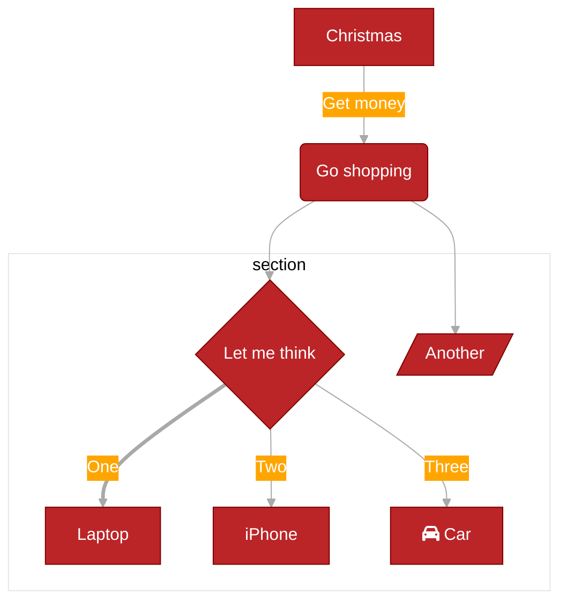

## Mermaid Fun

```mermaid {theme: 'neutral', scale: 0.8}
---
config:
  theme: 'base'
  themeVariables:
    primaryColor: '#BB2528'
    primaryTextColor: '#fff'
    primaryBorderColor: '#7C0000'
    lineColor: 'darkgray'
    secondaryColor: 'orange'
    tertiaryColor: '#fff'
---
        graph TD
          A[Christmas] -->|Get money| B(Go shopping)
          B --> C{Let me think}
          B --> G[/Another/]
          C ==>|One| D[Laptop]
          C -->|Two| E[iPhone]
          C -->|Three| F[fa:fa-car Car]
          subgraph section
            C
            D
            E
            F
            G
          end

```
