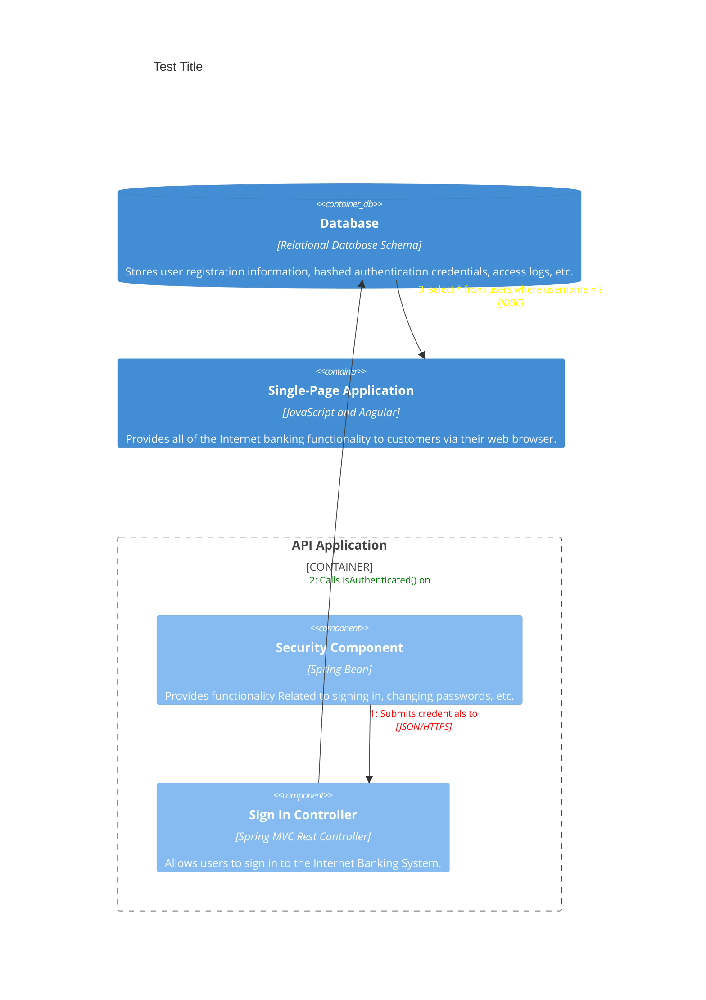

## C4 Fun

```mermaid {theme: 'neutral', scale: 0.5}
    C4Dynamic
    title Test Title

    Container_Boundary(b, "API Application") {
      
      Component(c1, "Security Component", "Spring Bean", "Provides functionality Related to signing in, changing passwords, etc.")
      
      Component(c2, "Sign In Controller", "Spring MVC Rest Controller", "Allows users to sign in to the Internet Banking System.")
    }

    ContainerDb(c3, "Database", "Relational Database Schema", "Stores user registration information, hashed authentication credentials, access logs, etc.")

    Container(c4, "Single-Page Application", "JavaScript and Angular", "Provides all of the Internet banking functionality to customers via their web browser.")
    
    Rel(c1, c2, "Submits credentials to", "JSON/HTTPS")
    Rel(c2, c3, "Calls isAuthenticated() on")
    Rel(c3, c4, "select * from users where username = ?", "JDBC")

    UpdateRelStyle(c1, c2, $textColor="red", $offsetY="-40")
    UpdateRelStyle(c2, c3, $textColor="green", $offsetX="-40", $offsetY="60")
    UpdateRelStyle(c3, c4, $textColor="yellow", $offsetY="-40", $offsetX="10")

```
