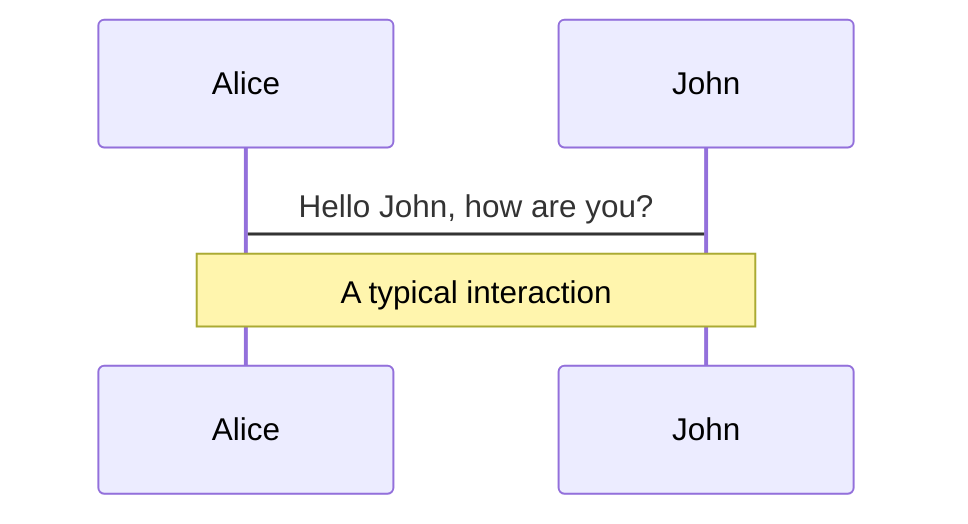

<TitleSlide>
  <template #title>
    My Presentation
  </template>
  <template #subtitle>
    Reusable Slidev Template
  </template>
</TitleSlide>

---

# Agenda

- Topic 1
- Topic 2
- Topic 3


---

# Two Column Example

<TwoColumn>
  <template #left>
    <div>
      <h3>Left Side</h3>
      <ul>
        <li>Point A</li>
        <li>Point B</li>
      </ul>
    </div>
  </template>

  <template #right>
    <div>
      <h3>Right Side</h3>
      <ul>
        <li>Insight 1</li>
        <li>Insight 2</li>
      </ul>
    </div>
  </template>
</TwoColumn>

---

# Code Example

```ts
console.log('Hello, World!')
```


---

# Latex Support

- Slidev comes with LaTeX support out-of-box, powered by KaTeX.

### Single Line 
- $\sqrt{3x-1}+(1+x)^2$


### Block

$$
\begin{aligned}
\nabla \cdot \vec{E} &= \frac{\rho}{\varepsilon_0} \\
\nabla \cdot \vec{B} &= 0 \\
\nabla \times \vec{E} &= -\frac{\partial\vec{B}}{\partial t} \\
\nabla \times \vec{B} &= \mu_0\vec{J} + \mu_0\varepsilon_0\frac{\partial\vec{E}}{\partial t}
\end{aligned}
$$


---

# Mermaid Diagrams

