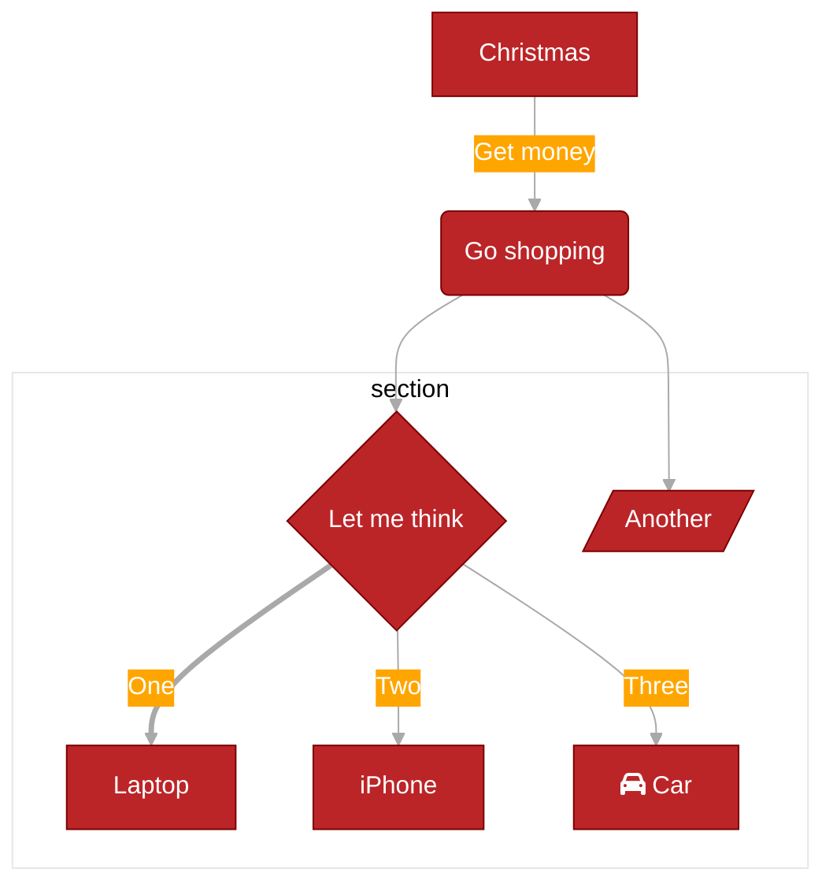
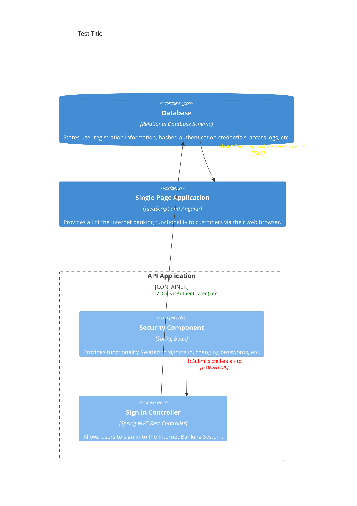

<template #title>
Building Beautiful Slides
</template>

<template #subtitle>
Vue-powered presentations · May 2026
</template>

---
layout: cover
background: test.png
class: 'text-white'
---

# Page 2

This is a page with the layout `center` and a background image.

<div
  v-motion
  :initial="{ x: -80 }"
  :enter="{ x: 0, y: 0 }"
  :click-1="{ x: 0, y: 30 }"
  :click-2="{ y: 60 }"
  :click-2-4="{ x: 40 }"
  :leave="{ y: 0, x: 80 }"
>
  Slidev
</div>

<!-- This is a **note** -->

---

# Page 3

This is a default page without any additional metadata.


## With Code Block

```ts
console.log('Hello, World!')
```


## Run Code via

```ts {monaco-run} {autorun:false}
function distance(x: number, y: number) {
  return Math.sqrt(x ** 2 + y ** 2)
}
console.log(distance(3, 4))
```


---
layout: quote
---

## Comark

This is a [red text]{style="color:red"} :inline-component{prop="value"}

{width=250px lazy}

::block-component{prop="value"}
The **default** slot is a strange thing.
::


---

## Comark II

> [!NOTE]
> Useful information that users should know, even when skimming content.

> [!TIP]
> Helpful advice for doing things better or more easily.

> [!IMPORTANT]
> Key information users need to know to achieve their goal.

> [!WARNING]
> Urgent info that needs immediate user attention to avoid problems.

> [!CAUTION]
> Advises about risks or negative outcomes of certain actions.

---

## Icons

#### Add Icons 

```shell 
yarn add @iconify-json/carbon @iconify-json/mdi @iconify-json/lucide
```

Use them via:

- Carbon: <carbon-warning class="text-red-500 text-2xl" />

- MDI: <mdi-rocket-launch class="text-2xl text-blue-500" />

- Or Lucide Icons: <lucide-github />


---

## Mermaide Fun





---

## C4 Fun




---

## LaTeX Fun

### Inline

- Surround your LaTeX with a single `$` on each side for inline rendering.

$\sqrt{3x-1}+(1+x)^2$


### Block

- Use two ($$) for block rendering. This mode uses bigger symbols and centers the result.

$$
\begin{aligned}
\nabla \cdot \vec{E} &= \frac{\rho}{\varepsilon_0} \\
\nabla \cdot \vec{B} &= 0 \\
\end{aligned}
$$


---

## Test Slide

- More here